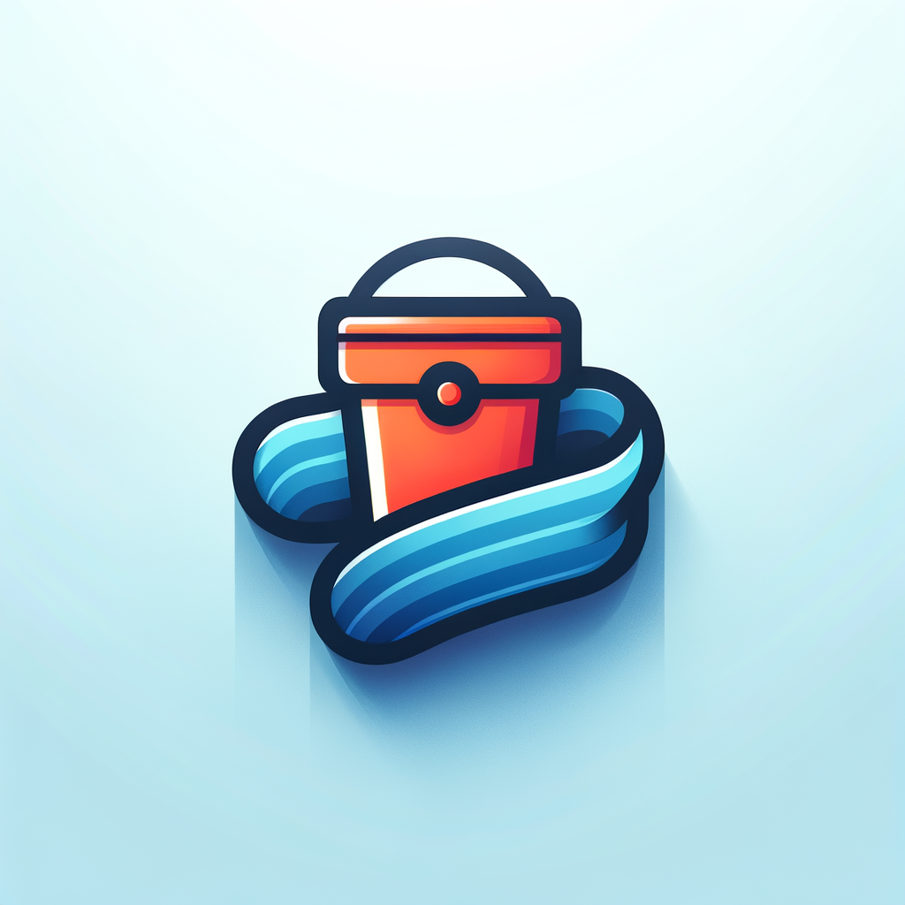

<a id="readme-top"></a>

<!-- PROJECT SHIELDS -->
<!--
*** https://www.markdownguide.org/basic-syntax/#reference-style-links
-->

[![Contributors][contributors-shield]][contributors-url]
[![Forks][forks-shield]][forks-url]
[![Stargazers][stars-shield]][stars-url]
[![Issues][issues-shield]][issues-url]
[![License][license-shield]][license-url]

<!-- PROJECT LOGO -->
<br />
<div align="center">
  <a href="https://github.com/gafda/homelab">
    
  </a>

  <h3 align="center">HomeLab</h3>

</div>

<!-- TABLE OF CONTENTS -->
<details>
  <summary>Table of Contents</summary>
  <ol>
    <li>
      <a href="#about-the-project">About The Project</a>
      <ul>
        <li><a href="#built-with">Built With</a></li>
      </ul>
    </li>
    <li>
      <a href="#getting-started">Getting Started</a>
      <ul>
        <li><a href="#prerequisites">Prerequisites</a></li>
        <li><a href="#installation">Installation</a></li>
      </ul>
    </li>
    <li><a href="#usage">Usage</a></li>
    <li><a href="#roadmap">Roadmap</a></li>
    <li><a href="#contributing">Contributing</a></li>
    <li><a href="#license">License</a></li>
    <li><a href="#contact">Contact</a></li>
  </ol>
</details>

<!-- ABOUT THE PROJECT -->

## About The Project

![product-screenshot]

This project is designed to provide a comprehensive monitoring solution using Heimdall as a dashboard interface, integrated with Prometheus, Grafana, Node Exporter, and Glances for complete system monitoring. Additionally, a Storage Bucket built with TypeScript, Next.js, Tailwind CSS, and MongoDB, with MongoDB data accessible through the Mongo Express service.

<p align="right">(<a href="#readme-top">back to top</a>)</p>

<!-- BUILT WITH -->

### Built With

-   [![React][react-shield]][react-url]
-   [![Next.js][nextjs-shield]][nextjs-url]
-   [![Typescript][typescript-shield]][typescript-url]
-   [![Tailwind CSS][tailwindcss-shield]][tailwindcss-url]
-   [![MongoDB][mongodb-shield]][mongodb-url]
-   [![Docker][docker-shield]][docker-url]
<p align="right">(<a href="#readme-top">back to top</a>)</p>

<!-- FEATURES -->

### Features

-   [x] Heimdall Dashboard for central access point for all services
-   [x] Prometheus for metrics collection and storage
    -   [x] Node Exporter for hardware and OS metrics
-   [x] Grafana for visualization and analytics
-   [x] Glances for system monitoring tool
-   [x] Storage bucket
    -   [x] Authentication via NextAuth
    -   [x] MongoDB connection
    -   [x] Mongo Express for managing MongoDB

**Legend:**

-   [x] -   Completed
-   [ ] -   In Progress

<!-- GETTING STARTED -->

## Getting Started

### Prerequisites

Software:

-   node v22.9.0
-   npm v10.8.3
-   docker v27.4.1

Extra:

-   Internet access
-   Web browser

### Installation

1.  Clone the repo

    ```sh
    git clone https://github.com/hreis00/homelab.git
    cd homelab
    ```

2.  Create environment files

    ```bash
    cp .env.example .env && cd storage-bucket && cp .env.example .env && cd ..
    ```

<!-- 3.  Update both .env.grafana and .env files with your settings

    ```bash
    # Grafana
    GF_SECURITY_ADMIN_PASSWORD=your-admin-password-here
    GF_USERS_ALLOW_SIGN_UP=false
    ```

    ```bash
    # Storage Bucket
    MONGODB_URI=your-mongodb-connection-string-here
    NEXTAUTH_URL=http://localhost:3000
    NEXTAUTH_SECRET= # Generate a secret, in the terminal, with: openssl rand -base64 32
    NEXT_PUBLIC_API_URL=http://localhost:3000
    ``` -->

3.  Start the Application

    ```bash
    docker compose -f docker-compose.yml up -d
    ```

4.  Wait for Docker to finish his magic and navigate to `http://localhost:80`

5.  Enjoy!

<p align="right">(<a href="#readme-top">back to top</a>)</p>

<!-- USAGE EXAMPLES -->

## Usage

After starting the containers, access the services at:

-   **Heimdall**: http://localhost:80
-   **Grafana**: http://localhost:3002
    -   Default username: `admin`
    -   Default password: `admin`
-   **Prometheus**: http://localhost:9090
-   **Node Exporter**: http://localhost:9100/metrics
-   **Glances**: http://localhost:61208
-   **Storage Bucket**: http://localhost:3000
-   **Mongo Express**: http://localhost:8081

For more examples, please refer to the [Documentation](/docs/DEVELOPMENT.md)

<p align="right">(<a href="#readme-top">back to top</a>)</p>

<!-- ROADMAP -->

## Roadmap

-   [ ] Make better documentation (2025)

See the [open issues](https://github.com/hreis00/homelab/issues) for a full list of proposed features (and known issues).

<p align="right">(<a href="#readme-top">back to top</a>)</p>

<!-- CONTRIBUTING -->

## Contributing

Contributions are what make the open source community such an amazing place to learn, inspire, and create. Any contributions you make are **greatly appreciated**.

If you have a suggestion that would make this better, please fork the repo and create a pull request. You can also simply open an issue with the tag "enhancement".
Don't forget to give the project a star! Thanks again!

1. Fork the Project
2. Create your Task Branch (`git checkout -b task-my-awesome-task`)
3. Commit your Changes (`git commit -m 'Add some thing that you did.'`)
4. Push to the Branch (`git push origin task-my-awesome-task`)
5. Open a Pull Request from `task-my-awesome-task` to `dev` branch.
   a. Please include a summary of the changes you made.
   b. Include screenshots or gifs if applicable.
   c. Include relevant links to issues or documentation.
   d. Assign to yourself
   e. Request a review from the project maintainer(s)

**NOTES:**

-   Please use the following naming convention for branches:

a. (task) - for tasks: `git checkout -b task-my-awesome-task`
b. (feature) - for new features: `git checkout -b feature-my-amazing-feature`
c. (bug) - for bug fixes: `git checkout -b fix-my-awesome-fix`

### Top contributors:

<a href="https://github.com/hreis00/homelab/graphs/contributors">
  
</a>

<p align="right">(<a href="#readme-top">back to top</a>)</p>

<!-- LICENSE -->

## License

Distributed under the GPL-3 License. See `LICENSE.txt` for more information.

<p align="right">(<a href="#readme-top">back to top</a>)</p>

<!-- CONTACT -->

## Contact

Hugo Reis - [@hbssreis@gmail.com](mailto://hbssreis@example.com)

Project Link: [https://github.com/hreis00/homelab](https://github.com/hreis00/homelab)

<p align="right">(<a href="#readme-top">back to top</a>)</p>

<!-- MARKDOWN LINKS & IMAGES -->
<!-- https://www.markdownguide.org/basic-syntax/#reference-style-links -->
<!-- From own repo -->

[contributors-shield]: https://img.shields.io/github/contributors/hreis00/homelab.svg?style=for-the-badge
[contributors-url]: https://github.com/hreis00/homelab/graphs/contributors
[forks-shield]: https://img.shields.io/github/forks/hreis00/homelab.svg?style=for-the-badge
[forks-url]: https://github.com/hreis00/homelab/network/members
[issues-shield]: https://img.shields.io/github/issues/hreis00/homelab.svg?style=for-the-badge
[issues-url]: https://github.com/hreis00/homelab/issues
[license-shield]: https://img.shields.io/github/license/hreis00/homelab.svg?style=for-the-badge
[license-url]: https://github.com/hreis00/homelab/blob/master/LICENSE.txt
[stars-shield]: https://img.shields.io/github/stars/hreis00/homelab.svg?style=for-the-badge
[stars-url]: https://github.com/hreis00/homelab/stargazers

<!-- From repo images -->

[product-screenshot]: ./docs/images/heimdall.png

<!-- From badges -->

[react-shield]: https://img.shields.io/badge/React-18.0.0+-%2320232a.svg?style=for-the-badge&logo=react&logoColor=%2361DAFB
[react-url]: https://react.dev
[nextjs-shield]: https://img.shields.io/badge/Next.js-15.0.0+-black?style=for-the-badge&logo=next.js&logoColor=white
[nextjs-url]: https://nextjs.org
[typescript-shield]: https://img.shields.io/badge/TypeScript-5.0.0+-3178C6?style=for-the-badge&logo=typescript&logoColor=fff
[typescript-url]: https://www.typescriptlang.org
[tailwindcss-shield]: https://img.shields.io/badge/Tailwind%20CSS-3.0.0+-%2338B2AC.svg?style=for-the-badge&logo=tailwind-css&logoColor=white
[tailwindcss-url]: https://tailwindcss.com
[mongodb-shield]: https://img.shields.io/badge/MongoDB-6.0.0+-green?style=for-the-badge&logo=mongodb
[mongodb-url]: https://www.mongodb.com
[docker-shield]: https://img.shields.io/badge/Docker-24.0+-2496ED?style=for-the-badge&logo=docker&logoColor=white
[docker-url]: https://www.docker.com
